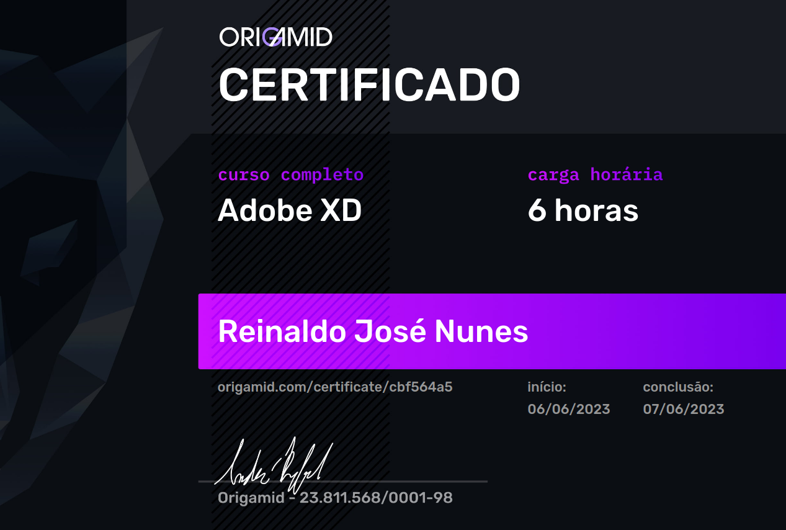

<h1 align="center"> Little Invest App </h1>

<p align="center">
  Projeto prático feito em Nuxt.js 3 + Tailwind CSS como forma de prática do curso de design de interface da Origamid.
</p>

<br>

<p align="center">
  
</p>
<br /><br />

## 🚀 Tecnologias

Esse projeto foi desenvolvido com as seguintes tecnologias:

- [Nuxt.js 3](https://nuxt.com/)
- [Tailwind CSS](https://tailwindcss.com/)

## 💻 Projeto

O projeto é uma codificação do projeto de interface gráfica do curso de UI Design - Adobe XD, ofertada pela [Origamid](https://www.origamid.com/). O projeto está em constante atualização.

<h1 align="center"> Setup Front-end</h1>

## 🔥 Front-end

Instale as dependências do projeto:

```
npm install
```

Rode a aplicação:

```
npm run dev
```

ou

```
npm run build
```

<br /><br /><br />

<h1 align="center"> Curso e Certificação</h1>

## 💻 Curso Adobe XD - Interface

- [Acesse o curso clicando aqui](https://www.origamid.com/curso/adobe-xd/)
  <br /><br />

## 🚀 Certificado

<p align="center">
  
</p>

<h4 align="center">
 
  <br />
  Feito com ♥ no Ubuntu 22.04 LTS
</h1>
